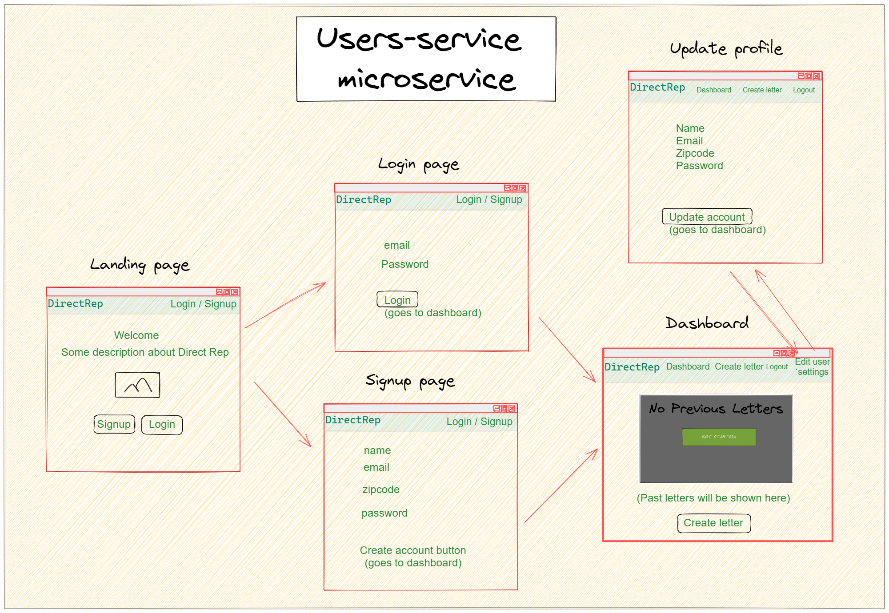
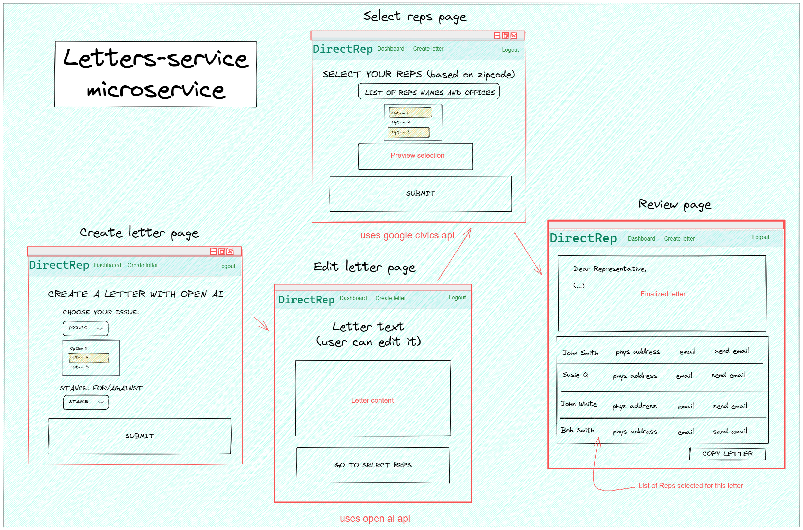
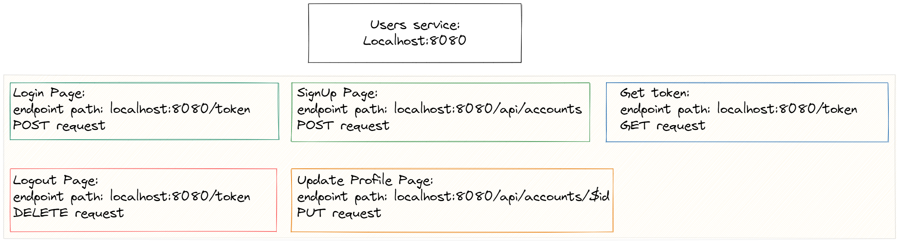
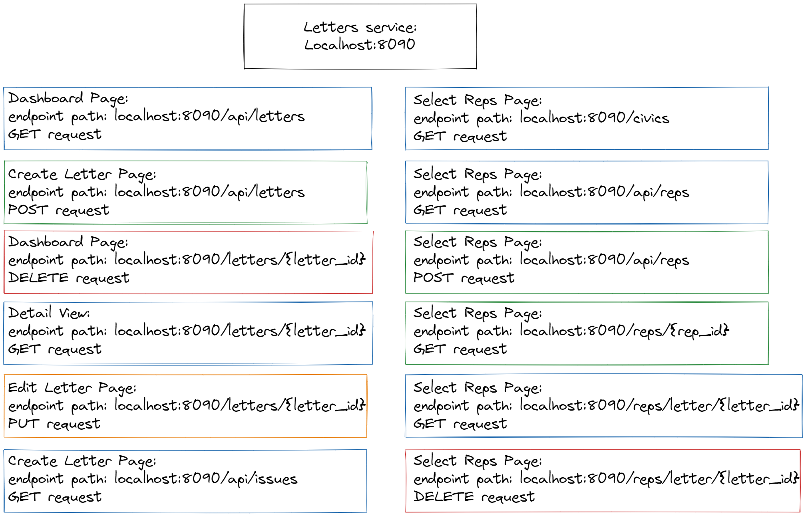

# Direct Rep

## Who are your customers?

People residing in the United States of America.

## What needs/desires does your application satisfy for your customers?

Making contacting your elected officials more accessible

## What features/functionality do you plan to have in the application that helps your customers?

- List of representatives with their details.
- List of issues.
- Open AI to draft an automated AI generated letter.
- Login / logout feature.
- Email template sent to user’s email with letter draft and rep’s emails list.
- Keep track of past letter templates / requests

## Design

### Users endpoints

[API Design Users](api-design-users.md)

### Letters endpoints

[API Design Letters](api-design-letters.md)

### Wireframe and endpoints diagrams

## Stretch Goals

- Info about upcoming elections
- “Am I registered?” function to check user voter registration
- “When’s the next election?” function
- Direct Rep uses your location and the Google Civic Information API to gather information about your representatives.

## The Team

- Aaryan Mittal- Developer 💻

- John Gardner - Developer 💻

- Kim Geraghty - Developer 💻

- Vincent Phung - Developer 💻
